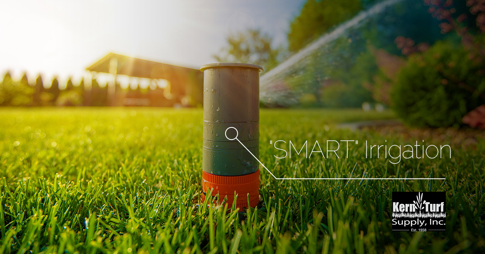
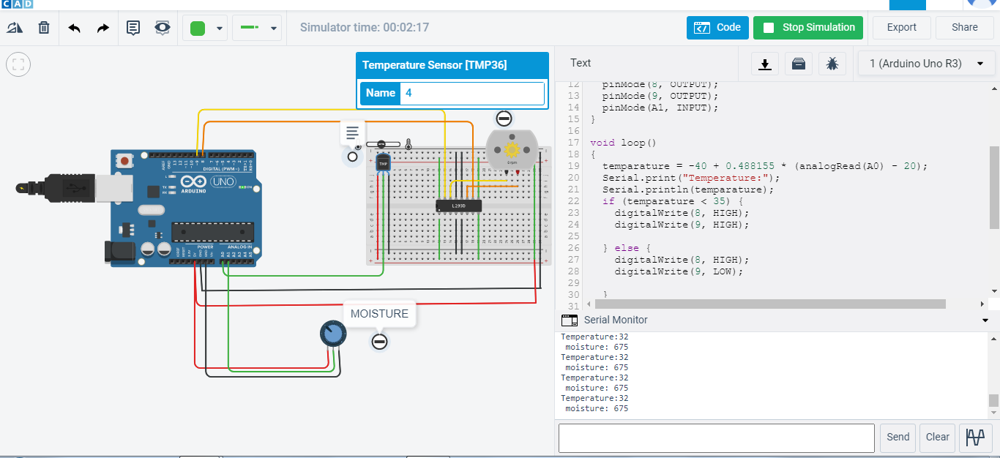
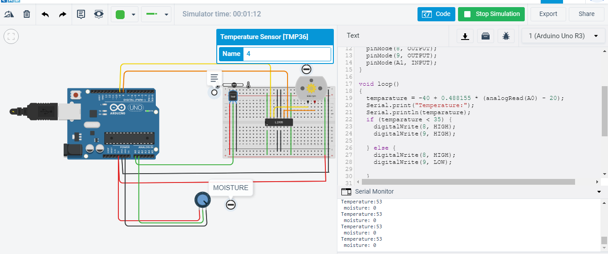
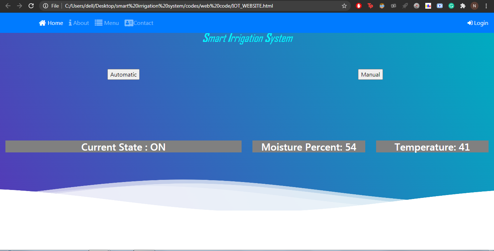
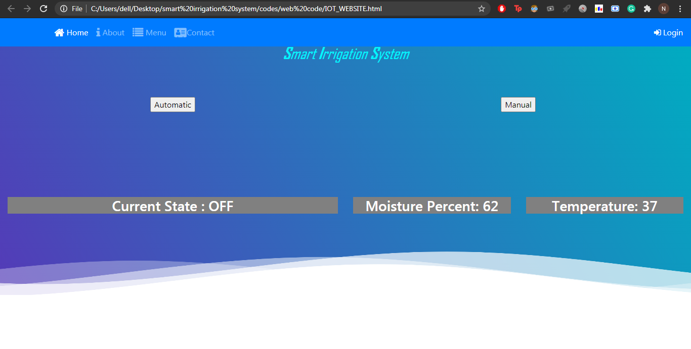
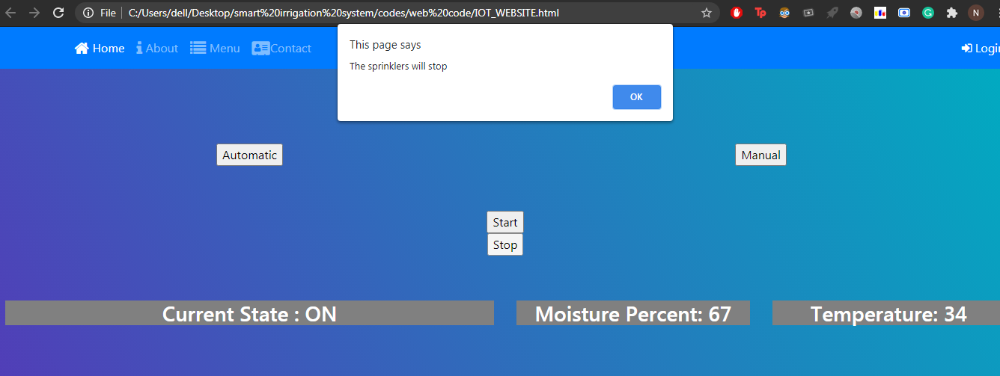
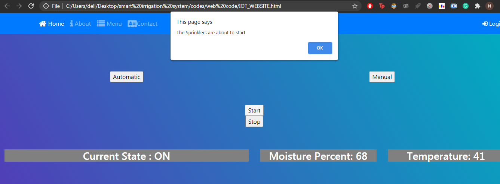

**SMART IRRIGATION SYSTEM** 

**INTRODUCTION** 
The main objective of this project is to provide water automatically based on the moisture
value and temperature value. If the moisture value drops the relay motor starts and and vice versa
too. It also depends on the temperature , if it gets higher the motors start and irrigation is done
using a microcontroller (Arduino Uno). There are many systems available to water savings in
various crops, from basic ones to more technologically advanced ones. For instance, in one
system plant watering status was monitored and irrigation scheduled based on temperature
presents in the soil content of the plant.

**PROBLEM FORMULATION** 
The traditional method of irrigation wastes a lot of water , which already had become a scarcity
due to increased population. The land is irrigated no matter what the soil moisture and external
temperature is. This eventually does not consider the the factor that many times the fields are
over irrigated and to overcome this problem , SMART IRRIGATION SYSTEM is used.
It basically turns ON/OFF the motors connected to a microcontroller which takes in account the
factors mentioned above without the intervention of farmers.

**OBJECTIVES** 
1. Build a website for this system , having automatic and manual modes. 
2. Controlling the motors with just a click on the button. 
3. Building a TinkerCad model to illustrate the working of the motors and sensors. 

**MODEL** 
Tinkerkad is a modelling program which is used for 3D design and runs in a web browser. A
model for this system is made using a relay motor, Arduino UNO , breadboard , H-bridge motor
driver. When we start the simulation and change the moisture value to less than 600 , then the
motor will start rotating . Moreover the motor will also be switched ON if we increase the
temperature more than 35 degree Celsius.In all other cases the motor will be in OFF state.
It basically means that if it rains the moisture will increase leaving behind the threshold value ,
the motor will be in ON state. Moreover if it's very sunny day , and the temperature increases
more than the already set threshold temperature the motor will be in ON state and sprinklers will
irrigate the huge farms without any human interference.

**WEBSITE** 
The website has been made with the help of HTML, CSS , JAVASCRIPT and BOOTSTRAP.
Rough data for the temperature and moisture value has been created covering all types of values
so that we can attain ON as well as OFF state of the motor. The website has two modes for
operating the system - one is Manual and other is Automatic mode. In manual mode there are
two buttons - START to voluntarily start the motors when we click on it and STOP to stop it. In
the automatic mode the data that has been made is fed and conditions are applied on it for the
ON/OFF state . When the temperature is greater than 35 degree celsius or moisture is less than
60% it will be in ON state and in rest of the cases the motors will be in OFF state.

**RESULTS AND OUTCOMES**  
**TINKERCAD** 
1.Temperature-32 degree Celsius(<35) 
2. Moisture content- 675 (>600) 
Motor will be in OFF state (RPM=0) 

   

1.Temperature-53 degree Celsius(>35) 
2. Moisture content- 0 (<600) 
Motor will be in ON state (notice RPM value on the motor) 

**WEBSITE-**

**AUTOMATIC MODE-**
1. Temperature-41 degree Celsius(>35)
2. Moisture content- 54 (<60%)
3. Motor will be in ON state

1.Temperature-37 degree Celsius(>35) 
2.Moisture content- 62 (>60%) 
3.Motor will be in OFF state 

**MANUAL MODE** 
The sprinkler will stop as soon as we click on the OK button.

The sprinkler will start as soon as we click on the OK button.

**CONCLUSION** 
This System will be saving both Water and the time and hard work of the farmers in the process of irrigation of feilds With more and more advanced technologies
and further improvements can make it more efficient, fast and easy to use and way cheaper. We
can also incorporate the rainfall and harvesting patterns, soil types and their requirements , and
some other physical factors. This application in the field of agriculture with use of
hardwares and IOT ensures the proper usage of water resources and increase in the agricultural
production.
